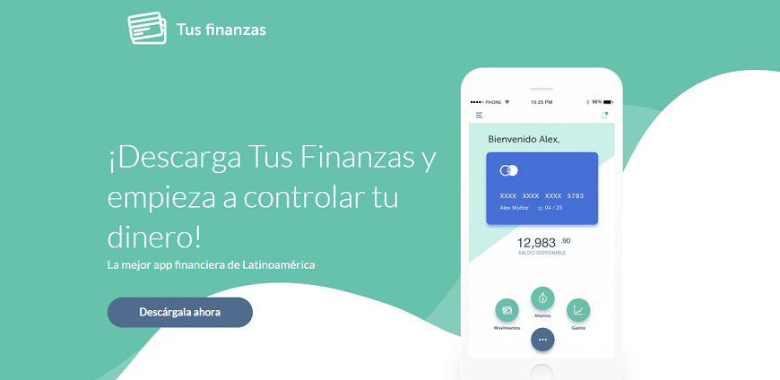
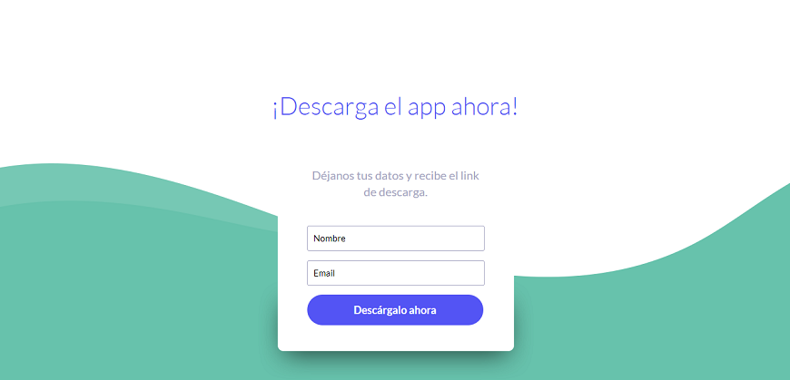

# Aplicación financiera

## Preámbulo

El banco más importante del país ha lanzado una nueva aplicación móvil al
mercado para que sus usuarios puedan visualizar sus gastos mensuales y fomentar
el ahorro. Luego de tener algunos meses en el mercado y algo de tracción, el
equipo detrás de este nuevo producto ha decidido contratar a una
agencia/consultora de UX que los ayude a definir la dirección y evolución del
producto. 

## Introducción

### Contexto

Durante la primera semana de entendimiento de los requerimientos, el Product
Manager del equipo brinda el contexto:

>“Todo empezó hace un año cuando vimos que en EEUU y Europa estaban saliendo
  nuevas aplicaciones financieras que nos llamaron la atención. Unas se enfocan
  en darle visibilidad a sus usuarios sobre los gastos, otras en facilitar pagos
  a terceros y otras a fomentar el ahorro. Inspirados en un par de ellas,
  decidimos lanzar una nueva aplicación. Decidimos que era mejor crear un
  producto desde cero - en lugar de modificar la aplicación actual de banca
  móvil - para poder desarrollarla con un equipo totalmente nuevo, en el
  laboratorio de innovación, bajo prácticas ágiles. Sabemos que no es ideal que
  nuestros usuarios tengan que usar dos aplicaciones, pero desarrollar con un
  equipo nuevo que corra ágil nos da mayor libertad.

> Empezamos entrevistando a algunos usuarios y revisando los resultados de un
  estudio de mercado que nos proporcionó el área de marketing. Eso nos dió una
  idea inicial de qué funcionalidades son más relevantes aquí en nuestro
  mercado. Con base en esos resultados, creamos nuestros primeros user personas
  una primaria y una secundaria ( creemos que estas personas no son las que
  nosotros pensábamos inicialmente), y diseñamos y desarrollamos un ‘Producto
  mínimo viable’ (MVP) en 2 meses en iOS. Ese MVP lo hemos lanzado y tenemos
  alrededor de 6 meses de data. Hoy estamos en el proceso de entender los
  resultados iniciales y de sacar una segunda iteración del producto. Y para eso
  las hemos contratado. Toda la documentación de este producto la tenemos en una
  carpeta de [Google Drive](http://bit.ly/uxd-reto-2). Les doy acceso.
  
> Necesitamos traer una propuesta del nuevo diseño en dos semanas porque tenemos
  que presentarla a nuestro Gerente General en la reunión trimestral. Es
  importante que cualquier cosa que presentemos ya incorpore feedback de testing
  con usuarios. El Gerente General, animado por el crecimiento del número de
  descargas que ha tenido el app, quiere duplicar el presupuesto de Facebook
  Ads… Yo no estoy tan seguro; quisiera que como parte de su trabajo estas
  próximas dos semanas, entendamos ese punto también.”

### Recursos iniciales

En esta carpeta de [Google Drive](http://bit.ly/uxd-reto-2) y en los siguientes
links, encontrarán:

- Los user persona primario y secundario del proyecto.
- Los user flows iniciales y actuales del proyecto del MVP.
- El [diseño de la app en Figma](https://www.figma.com/file/Gr5GEIRrjF9eIplIeEHUSJNt/proyecto-2-banca?node-id=0%3A477)
  , con una guía de componentes y el [Prototipo navegable](https://marvelapp.com/e9h245e)
- Funnel Analytics de los primeros 6 meses del MVP
- Data de uso del MVP de los primeros 6 meses
- [Landing Page](http://tus-finanzas.pagedemo.co) inicial del producto

## Objetivos iniciales del proyecto 

Los objetivos iniciales son investigar el producto y encontrar los problemas que tiene el MVP de nuestro cliente, para poder idear una solución. También poder testear con el usuario para validar el problema y la solución.

## Cliente

### _1. Preguntas hechas al cliente_

1. ¿Cuáles son los objetivos iniciales por los que decidieron crear esta app? Contexto.
2. ¿Qué resultados esperan con esta segunda iteración del producto?
3. ¿Qué beneficios les ha traído esta app?
4. ¿Han tenido alguna dificultad con el hecho de que sea una app separada?
5. ¿Por qué han desarrollado esta app solamente para iOS?
6. ¿Por qué no está implementada para Android?
7. ¿Los colores utilizados en la app: verde, azul y rosado, son los mismos que la app de banca móvil y/o de la empresa?
8. ¿Qué tanto quieren que el usuario diferencie la app Tus finanzas con la app de banca móvil?
9. Si tu empresa fuera una persona, ¿cómo sería?

### _2. Conclusiones de entrevista con el cliente_

El cliente tiene como objetivo ofrecer a los usuarios propios del banco las herramientas que necesitan para tener un control de sus gastos, así como también mejorar su capacidad de ahorro. 

Se desarrolló una app separada de la aplicación de banca móvil que tienen porque no necesariamente todos los usuarios del banco son el público objetivo de la solución planteada para el manejo de gastos y ahorros. Está dirigida a gente más joven. Y con esto el proceso se simplificaría al tener una aplicación alternativa.

Esta app de ahorros ayuda a fidelizar a los usuarios nuevos. Además, solo funciona si se tiene una cuenta en el banco de nuestro cliente, no con otros bancos.

El cliente espera que con esta iteración de la app, el usuario pueda utilizar adecuadamente las funcionalidades, ya que actualmente no están usando bien la funcionalidad de ahorro; y no se sabe la razón por la que están teniendo tales dificultades. Además, busca posicionar la aplicación como algo innovador en el mercado peruano.

Se cree que la publicidad no está cumpliendo bien su objetivo y quieren replantear la estrategia de marketing.

La aplicación está desarrollada solo en iOS porque es nueva y es el MVP que se estableció. Pero hay disposición para implementar en Android, dadas las pruebas suficientes de que es necesario.

Los colores de la app son distintos a la de la banca móvil del banco pero tienen una relación, _conversan_ entre ellas. Se ha intentado dar un estilo diferente porque es una aplicación diferente. El cliente quiere que el usuario pueda diferenciar cuando está en la banca móvil y en la app de ahorro, o sea encontrar un equilibrio entre las diferencias y el hecho de que vienen del mismo banco.

El cliente está abierto a la posibilidad de cambiar el nombre de la app. Quiere que su app se distinga por su disposición a innovar, que tenga un lenguaje amigable; pero por sobretodo que demuestre seguridad y confianza, dado que es una aplicación de banco.

## Usuarios

### _1. Preguntas para el usuario_

Después de hacer un pequeño filtro y asegurarnos que los entrevistados tengan tarjeta y cuenta de ahorros en un banco, pensamos en las siguientes preguntas:

1. ¿Cuántos años tienes?
2. ¿A qué te dedicas?
3. ¿Qué haces en tus ratos libres?
4. ¿Qué dispositivos utilizas con mayor frecuencia?
5. ¿En qué sueles gastar tu dinero?
6. ¿En la actualidad hay alguna compra específica que quisieras realizar? (ver pregunta 7 o 10 según sea el caso)
7. (Si la respuesta es "sí") ¿Por qué no has realizado esa compra aún?
8. (Sigue desde 7) ¿Planeas comprar eso a futuro?
9. (Sigue desde la 8) ¿Cómo lo vas a lograr? ¿Tienes pensada alguna forma de alcanzar tu meta? (Si no sabe qué responder, dar opciones como préstamo, ahorro, etc.)
10. (Si la respuesta es "no") ¿Y alguna vez has realizado una compra que hayas querido hacer por mucho tiempo?
11. (Sigue desde la 10) Descríbeme cómo fue el proceso de compra, tu experiencia desde que decidiste adquirir ese producto.
12. ¿Qué medios de pago utilizaste para realizar esa compra?
13. ¿Qué dificultades tuviste para poder tener el dinero y comprar el producto?
14. ¿De qué manera ahorras? ¿Cómo llevas la contabilidad de tus ahorros y gastos?
15. ¿Es el único método de ahorro que conoces?
16. ¿En qué banco tienes tu tarjeta de débito?
17. ¿Por qué elegiste ese banco?
18. ¿Qué beneficios te da?
19. ¿Tienes la app móvil de tu banco instalada en tu celular? ¿Por qué?
20. ¿Qué beneficios te brinda tener esa app en tu celular?
21. ¿Qué es lo que más te gusta de esa aplicación? ¿Por qué?
22. ¿Qué dificultades has tenido con esa aplicación?
23. ¿Te gustaría poder ahorrar y administrar tu dinero? ¿Por qué?
24. ¿Qué conoces sobre aplicaciones para ahorrar? 
25. Si utilizaras una aplicación móvil especialmente para ahorrar y ver tus gastos, ¿qué datos te gustaría encontrar y manejar?

## Problemas encontrados en la investigación

### Landing Page inicial

Hay un gran porcentaje de usuarios que rebotan en el landing page y no descargan la app. Al analizar la data, vemos que la mayoría de los rebotes se da por usuarios de dispositivos Android. 

Al ingresar a esta página, lo primero que se ve es una imagen de un celular iPhone, que en el caso de los que utilizan Android, es un pain point porque lo primero que puede pensar es que la app no está disponible para su celular o también puede causarle confusión en cuanto a ese tema.

Siguiendo la línea anterior, no se especifica que la aplicación esté disponible solo para descargar en iOS. Entonces el usuario puede irse porque le parece tedioso buscar si la puede descargar o no; es posible que el beneficio no le parezca lo suficiente para tomarse ese tiempo.

Otro problema con el landing page es el contraste y los colores. La imagen del celular se muestra con bordes blancos y el fondo también es blanco; por lo que, no se aprecia ni distingue correctamente el celular. La app se pierde entre esos colores. Asimismo, como se puede ver con el color de las letras, y con la última sección de "Descarga el app ahora", el color blanco no deja ver bien esa parte. 

También los botones, al principio y al final, tienen distinto color. Incluso al pasar el cursor, difieren los colores; especialmente en el último botón, el color es totalmente distinto a lo anterior. No hay lineamientos que se respeten. 

El tamaño de las fotos de los usuarios que comentan es muy pequeño para el espacio que hay.

## Herramienta de organización

Para este proyecto decidimos utilizar Trello para organizarnos.

