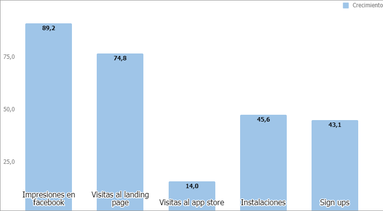
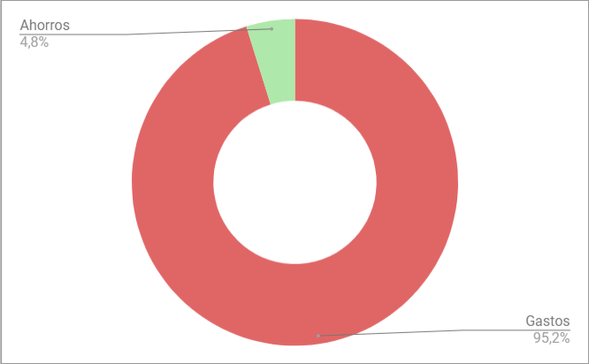
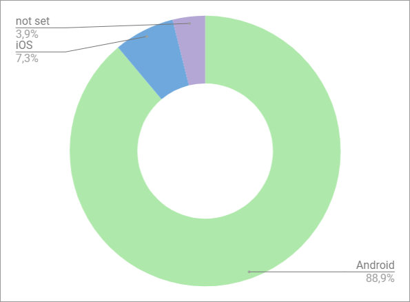
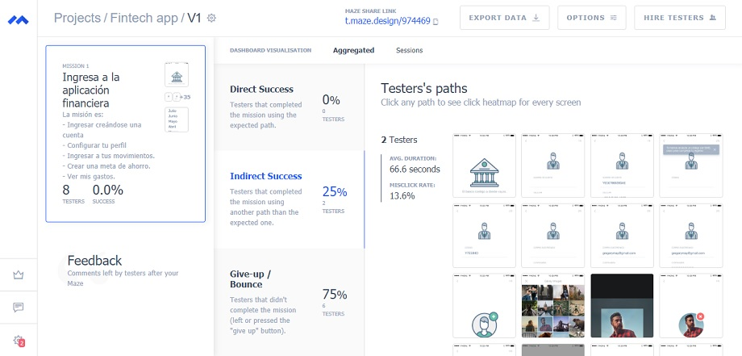
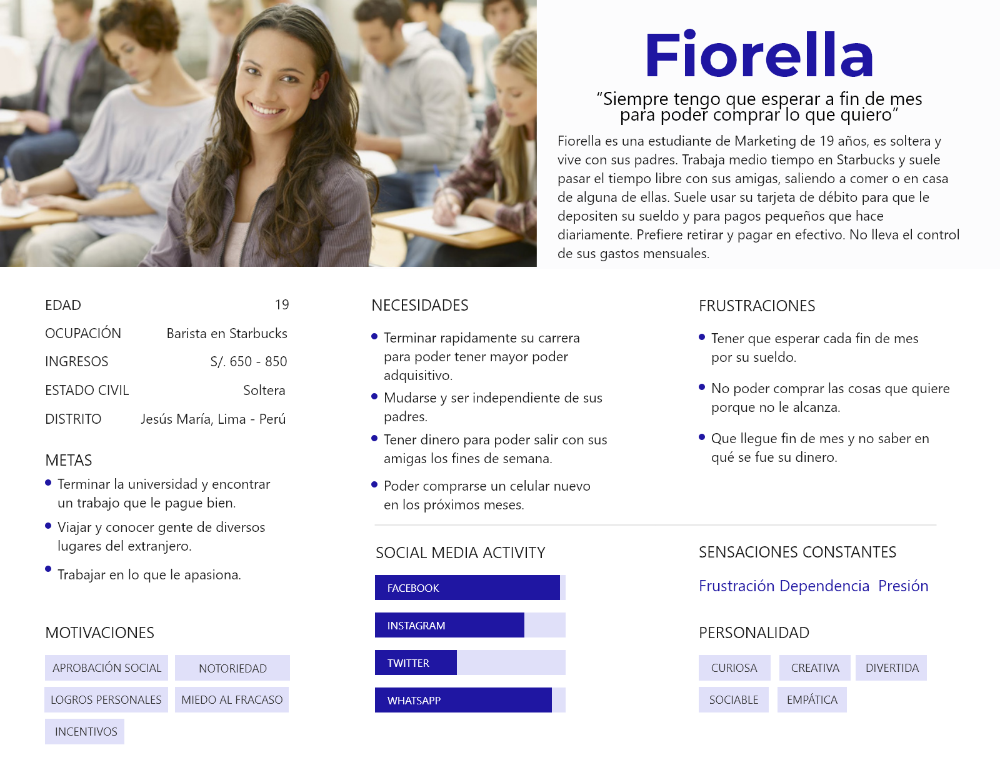
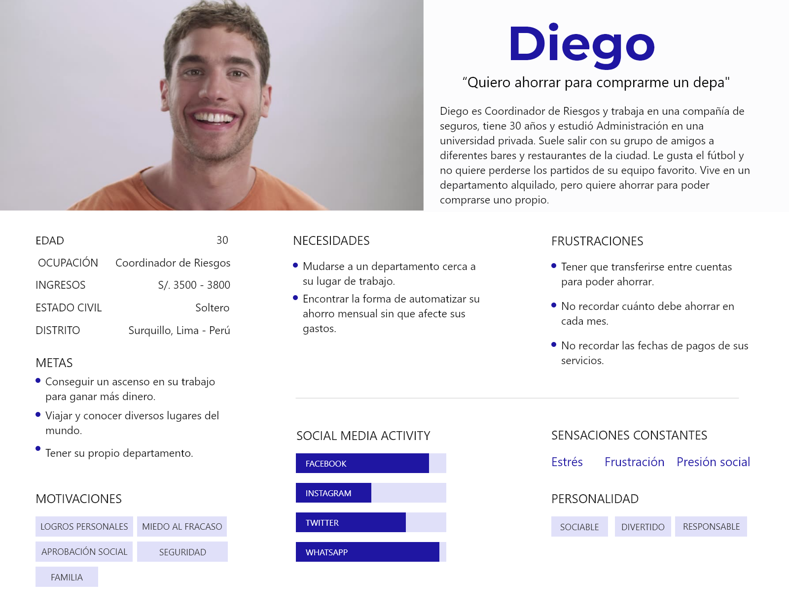
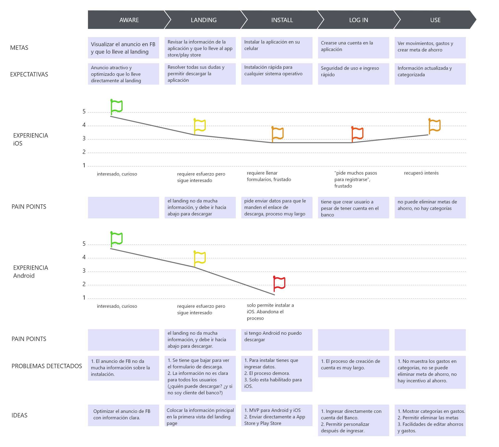
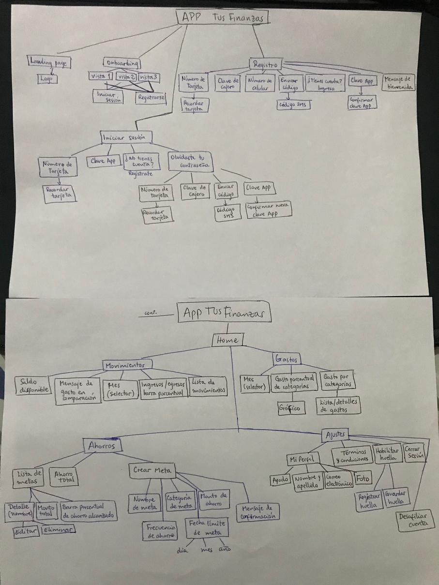

# Proceso de rediseño de una aplicación financiera

### Preámbulo

El banco más importante del país ha lanzado una nueva aplicación móvil al
mercado para que sus usuarios puedan visualizar sus gastos mensuales y fomentar
el ahorro. Luego de tener algunos meses en el mercado y algo de tracción, el
equipo detrás de este nuevo producto ha decidido contratar a una
agencia/consultora de UX que los ayude a definir la dirección y evolución del
producto. 

## **Empatía**
### Contexto

Durante la primera semana de entendimiento de los requerimientos, el Product
Manager del equipo brinda el contexto:

>“Todo empezó hace un año cuando vimos que en EEUU y Europa estaban saliendo
  nuevas aplicaciones financieras que nos llamaron la atención. Unas se enfocan
  en darle visibilidad a sus usuarios sobre los gastos, otras en facilitar pagos
  a terceros y otras a fomentar el ahorro. Inspirados en un par de ellas,
  decidimos lanzar una nueva aplicación. Decidimos que era mejor crear un
  producto desde cero - en lugar de modificar la aplicación actual de banca
  móvil - para poder desarrollarla con un equipo totalmente nuevo, en el
  laboratorio de innovación, bajo prácticas ágiles. Sabemos que no es ideal que
  nuestros usuarios tengan que usar dos aplicaciones, pero desarrollar con un
  equipo nuevo que corra ágil nos da mayor libertad.

> Empezamos entrevistando a algunos usuarios y revisando los resultados de un
  estudio de mercado que nos proporcionó el área de marketing. Eso nos dió una
  idea inicial de qué funcionalidades son más relevantes aquí en nuestro
  mercado. Con base en esos resultados, creamos nuestros primeros user personas
  una primaria y una secundaria ( creemos que estas personas no son las que
  nosotros pensábamos inicialmente), y diseñamos y desarrollamos un ‘Producto
  mínimo viable’ (MVP) en 2 meses en iOS. Ese MVP lo hemos lanzado y tenemos
  alrededor de 6 meses de data. Hoy estamos en el proceso de entender los
  resultados iniciales y de sacar una segunda iteración del producto. Y para eso
  las hemos contratado. Toda la documentación de este producto la tenemos en una
  carpeta de [Google Drive](http://bit.ly/uxd-reto-2). Les doy acceso.
  
> Necesitamos traer una propuesta del nuevo diseño en dos semanas porque tenemos
  que presentarla a nuestro Gerente General en la reunión trimestral. Es
  importante que cualquier cosa que presentemos ya incorpore feedback de testing
  con usuarios. El Gerente General, animado por el crecimiento del número de
  descargas que ha tenido el app, quiere duplicar el presupuesto de Facebook
  Ads… Yo no estoy tan seguro; quisiera que como parte de su trabajo estas
  próximas dos semanas, entendamos ese punto también.”

### Recursos iniciales

En esta carpeta de [Google Drive](http://bit.ly/uxd-reto-2) y en los siguientes
links, encontrarán:

- Los user persona primario y secundario del proyecto.
- Los user flows iniciales y actuales del proyecto del MVP.
- El [diseño de la app en Figma](https://www.figma.com/file/Gr5GEIRrjF9eIplIeEHUSJNt/proyecto-2-banca?node-id=0%3A477)
  , con una guía de componentes y el [Prototipo navegable](https://marvelapp.com/e9h245e)
- Funnel Analytics de los primeros 6 meses del MVP
- Data de uso del MVP de los primeros 6 meses
- [Landing Page](http://tus-finanzas.pagedemo.co) inicial del producto

### Objetivos iniciales del proyecto 

Los objetivos iniciales son investigar el producto y encontrar los problemas que tiene el MVP de nuestro cliente, para poder idear una solución. También poder testear con el usuario para validar el problema y la solución.

### Análisis de la data proporcionada

Según la data proporcionada y la información entregada por el cliente, se tiene el siguiente flujo de descarga e instalación de la aplicación:

De los datos generales, obtenemos que del total de usuarios que ven el anuncio en Facebook **solo 2.4% ingresan al landing page**. Asimismo, de esta cantidad, el 12.4% que ingresa al landing page visita el App Store, y finalmente, del total que visita el App Store, solo el 12.8% instala la aplicación.

Asimismo, de la data mensual que nos entregaron, podemos obtener que, en 06 meses, de Febrero a Julio, se registraron los siguientes cambios:

Según los datos, las visitas al app store solo han aumentado el 14%, a diferencia de las impresiones en Facebook que lograron crecer un 89,2% o las visitas al landing page que aumentaron en un 74,8%.

**Uso de funcionalidades de la aplicación**

Por otro lado, referente al uso de la aplicación, tenemos lo siguiente como resultado:

Que el uso o consulta de la sección de Gastos representa casi la totalidad del uso de la aplicación (95,2%), dejando en segundo lugar a la sección de Ahorros.

**Dispositivos usados**

Por otro lado, se observó que la mayoría de usuarios que ingresan al landing page son usuarios de **dispositivos Android (88,9%)** lo cual genera un porcentaje de rebote del 77,9%.

**Conclusiones**

1. En los 06 meses desde que se lanzó el MVP, se ha registrado un crecimiento considerable en el alcance de la aplicación, sin embargo, el flujo que se quiso implementar desde un inicio (anuncio-landing-app store-descarga) no ha seguido un crecimiento parejo, pues se ve una caída considerable en las visitas al App Store. 

2. El mayor porcentaje de caída en el flujo de instalación de la aplicación se origina en el paso del anuncio en Facebook al landing page, lo que indica que el anuncio no está optimizado y no está cumpliendo su objetivo.

3. La mayoría de usuarios visitan el landing page usando dispositivos Android, lo cual genera un porcentaje de rebote alto en la página.

### Entrevista al cliente

#### _1. Preguntas hechas al cliente_

1. ¿Cuáles son los objetivos iniciales por los que decidieron crear esta app? Contexto.
2. ¿Qué resultados esperan con esta segunda iteración del producto?
3. ¿Qué beneficios les ha traído esta app?
4. ¿Han tenido alguna dificultad con el hecho de que sea una app separada?
5. ¿Por qué han desarrollado esta app solamente para iOS?
6. ¿Por qué no está implementada para Android?
7. ¿Los colores utilizados en la app: verde, azul y rosado, son los mismos que la app de banca móvil y/o de la empresa?
8. ¿Qué tanto quieren que el usuario diferencie la app Tus finanzas con la app de banca móvil?
9. Si tu empresa fuera una persona, ¿cómo sería?

#### _2. Conclusiones de entrevista con el cliente_

El cliente tiene como objetivo ofrecer a los usuarios propios del banco las herramientas que necesitan para tener un control de sus gastos, así como también mejorar su capacidad de ahorro. 

Se desarrolló una app separada de la aplicación de banca móvil que tienen porque no necesariamente todos los usuarios del banco son el público objetivo de la solución planteada para el manejo de gastos y ahorros. Está dirigida a gente más joven. Y con esto el proceso se simplificaría al tener una aplicación alternativa.

Esta app de ahorros ayuda a fidelizar a los usuarios nuevos. Además, solo funciona si se tiene una cuenta en el banco de nuestro cliente, no con otros bancos.

El cliente espera que con esta iteración de la app, el usuario pueda utilizar adecuadamente las funcionalidades, ya que actualmente no están usando bien la funcionalidad de ahorro; y no se sabe la razón por la que están teniendo tales dificultades. Además, busca posicionar la aplicación como algo innovador en el mercado peruano.

Se cree que la publicidad no está cumpliendo bien su objetivo y quieren replantear la estrategia de marketing.

La aplicación está desarrollada solo en iOS porque es nueva y es el MVP que se estableció. Pero hay disposición para implementar en Android, dadas las pruebas suficientes de que es necesario.

Los colores de la app son distintos a la de la banca móvil del banco pero tienen una relación, _conversan_ entre ellas. Se ha intentado dar un estilo diferente porque es una aplicación diferente. El cliente quiere que el usuario pueda diferenciar cuando está en la banca móvil y en la app de ahorro, o sea encontrar un equilibrio entre las diferencias y el hecho de que vienen del mismo banco.

El cliente está abierto a la posibilidad de cambiar el nombre de la app. Quiere que su app se distinga por su disposición a innovar, que tenga un lenguaje amigable; pero por sobretodo que demuestre seguridad y confianza, dado que es una aplicación de banco.

### Entrevista a usuarios

**Análisis previo del contexto de usuario**

Según [Datum](http://www.datum.com.pe/new_web_files/files/pdf/Millennials.pdf), el público objetivo al que se dirige el banco son los pertenecientes a la Generación Y o Millennials, quienes abarcan la edad entre 18 a 35 años. En el Perú, este público corresponde al 29% de la población total.

De esa cantidad, el 51% se encuentra trabajando y el 40% estudiando, y solo la mitad de la población tiene hábitos de ahorro. Como [información adicional](http://www.sbs.gob.pe/Portals/0/jer/BOLETIN-SEMANAL/2018/boletin-semanal-8-2018.pdf), la SBS nos indica que solo el 21% de los jóvenes entre 18 a 25 años (millennials menores) realizan una acción de ahorro. Lo cual está vinculado no solo a los niveles de gastos e ingresos, sino también a motivaciones de naturaleza conductual. 

Esto se debe a que prefieren el disfrute de corto plazo sobre la posesión física, es decir, ahorran para viajes, objetos, cursos o estudios cortos, mas no para una vivienda o para su vejez.

Sin embargo, según el estudio, para el 2030 esta generación constituirá más del 60% de la fuerza laboral, entre millennials y post-millennials, por lo que es importante inculcar en ellos el hábito del ahorro a largo plazo.

Según lo antes visto, podemos concluir que el user persona al que se dirige el banco mantiene la edad correcta (user persona primario y secundario) pero cuenta con características diferentes, los cuales validaremos con las entrevistas propuestas.

#### _1. Preguntas para el usuario_

Después de hacer un pequeño filtro y asegurarnos que los entrevistados tengan tarjeta y cuenta de ahorros en un banco, pensamos en las siguientes preguntas:

1. ¿Cuántos años tienes?
2. ¿A qué te dedicas?
3. ¿Qué haces en tus ratos libres?
4. ¿Qué dispositivos digitales utilizas con mayor frecuencia?
5. ¿En qué sueles gastar tu dinero?
6. ¿Qué medios de pago utilizas en tu día a día?
7. ¿En la actualidad hay alguna meta, objetivo, compra que quisieras realizar? (ver pregunta 8 u 11 según sea el caso)
8. (Si la respuesta es "sí") Cuéntame sobre eso. ¿Por qué no has realizado esa compra aún?
9. (Sigue desde 8) ¿Planeas comprar eso a futuro?
10. (Sigue desde la 9) ¿Cómo lo vas a lograr? ¿Tienes pensada alguna forma de alcanzar tu meta? (Si no sabe qué responder, dar opciones como préstamo, ahorro, etc.)
11. (Si la respuesta es "no") ¿Y alguna vez has realizado una compra que hayas querido hacer por mucho tiempo?
12. (Sigue desde la 11) Descríbeme cómo fue el proceso de compra, tu experiencia desde que decidiste adquirir ese producto.
13. ¿Qué dificultades tuviste para poder tener el dinero y comprar el producto?
14. ¿Qué formas de ahorro conoces?
15. ¿Ahorras tu dinero o has ahorrado en el pasado?
16. ¿De qué manera ahorras? ¿Por qué?
17. ¿Cómo llevas la contabilidad de tus gastos o ahorros? ¿Por qué?
18. ¿En qué banco tienes tu tarjeta de débito?
19. ¿Por qué elegiste ese banco?
20. ¿Qué beneficios te da?
21. ¿Tienes la app móvil de tu banco instalada en tu celular? ¿Por qué?
22. ¿Qué beneficios te brinda tener esa app en tu celular?
23. ¿Qué es lo que más te gusta de esa aplicación? ¿Por qué?
24. ¿Qué dificultades has tenido con esa aplicación?
25. ¿Te gustaría poder ahorrar y administrar tu dinero usando tu celular? ¿Por qué?
26. ¿Qué conoces sobre aplicaciones móviles para ahorrar? 
27. Si utilizaras una aplicación móvil especialmente para ahorrar y ver tus gastos, ¿qué datos te gustaría encontrar y manejar?
28. ¿Cómo la utilizarías, qué tareas harías?

#### _2. Conclusiones de entrevistas con los usuarios_

Los entrevistados son personas entre 18 y 33 años. Tres de ellos trabajan y dos estudian.

Todos los entrevistados usan el celular como su dispositivo principal, y la laptop como dispositivo secundario. 
Los medios de pago que utilizan son efectivo y tarjeta, con un poco más de frecuencia el efectivo.

Todos desean hacer una compra o cumplir una meta que varía en precio y que requiere de un ahorro previo, pero solo una entrevistada tiene control de gastos y cultura de ahorro, y destina un monto de sus ingresos exclusivamente para lograr su meta. Los demás guardan su dinero de lo que les sobra, entonces no es algo constante, no hay cultura de ahorro y tampoco un control de gastos. Algunos saben que en las aplicaciones de sus bancos pueden visualizar una cantidad limitada de gastos pero en realidad no utilizan esa herramienta.

Además de saber y entender la ventaja que habría en utilizar un aplicativo para ahorrar, lo que más buscan los usuarios es la seguridad, así como también ahorrar tiempo. Desean una aplicación segura y que pueda otorgarles las herramientas necesarias para realizar todos sus movimientos desde su celular.

Los datos que quieren ver los usuarios en la aplicación son el monto de su saldo disponible, los gastos que han tenido, todos sus movimientos, quieren poder destinar un monto de ahorro, a plazo fijo o no. Asimismo, les gustaría una función que les avisara si se están excediendo en sus gastos y que compare al mes pasado para poder ver su evolución.

Los usuarios que son estudiantes tienen menos posibilidad de ahorro porque normalmente no cuentan con ingresos monetarios, pero sí quieren ahorrar para obtener alguna meta. Estos usuarios están dispuestos a hacerlo apenas tengan la posibilidad.

## **Definición**

### Problemas encontrados en la investigación

#### Landing Page inicial

Hay un gran porcentaje de usuarios que rebotan en el landing page y no descargan la app. Al analizar la data, vemos que la mayoría de los rebotes se da por usuarios de dispositivos Android. 

Al ingresar a esta página, lo primero que se ve es una imagen de un celular iPhone, que en el caso de los que utilizan Android, es un pain point porque lo primero que pueden pensar es que la app no está disponible para su celular o también puede causarle confusión en cuanto a ese tema.

Siguiendo la línea anterior, no se especifica que la aplicación esté disponible solo para descargar en iOS. Entonces el usuario puede irse porque le parece tedioso buscar si la puede descargar o no; es posible que el beneficio no le parezca lo suficiente para tomarse ese tiempo.

De igual manera, al hacer clic en "descárgala ahora" al principio de la página, te dirige al final para escribir los datos del usuario y recibir el link de descarga. Este paso parece innecesario y puede provocar que el usuario abandone la página porque no quiere dar sus datos, sino que quisiera poder descargar inmediatamente la app.

En el landing page no se especifica que la app solo puede ser utilizada por usuarios del banco, por lo que aumenta el porcentaje de rebote cuando los usuarios se dan cuenta de eso.

Otro problema con el landing page es el contraste y los colores. La imagen del celular se muestra con bordes blancos y el fondo también es blanco; por lo que, no se aprecia ni distingue correctamente el celular. La app se pierde entre esos colores. Asimismo, como se puede ver con el color de las letras, y con la última sección de "Descarga el app ahora", el color blanco no deja ver bien esa parte. 

También los botones, al principio y al final, tienen distinto color. Incluso al pasar el cursor, difieren los colores; especialmente en el último botón, el color es totalmente distinto a lo anterior. No hay lineamientos que se respeten. 

El tamaño de las fotos de los usuarios que comentan es muy pequeño para el espacio que hay.

#### Testing inicial con Maze

Decidimos testear el prototipo inicial que nos brindó el cliente para obtener los primeros problemas y poder solucionarlos. Para realizar esta tarea utilizamos la herramienta Maze.design y la testeamos con 8 usuarios. 

Obtuvimos que ninguno llegó a la meta de manera directa. 2 de ellos cumplió la tarea indirectamente y 6 se rindieron o rebotaron. Entonces claramente había un problema con la aplicación. La mayoría se quedó en la parte de crearse una cuenta, y pensamos que una de las razones era por tantos pasos que tenían que hacer.

## **Ideación**

### User persona primario - validado

### User persona secundario - validado

### Customer Journey Map

### Árbol de contenidos

## **Prototipado**

### Prototipo en alta fidelidad

[Link a proyecto en Figma](https://www.figma.com/proto/WdDpSO2tP3x0YZsCCKJEomEk/Financial-App-Android?node-id=2%3A0&scaling=scale-down)

### Zeplin

[Link a proyecto en Zeplin](https://zpl.io/scene/bo9lpLg)

### Video Loom

[Link del video](https://www.useloom.com/share/066af5cbaf0e4da5becd78ecfe7bb17c)

### Herramienta de organización

Para este proyecto decidimos utilizar Trello para organizarnos.

[Link al proyecto en Trello](https://trello.com/b/sXtLmOH2/financial-app)

## 